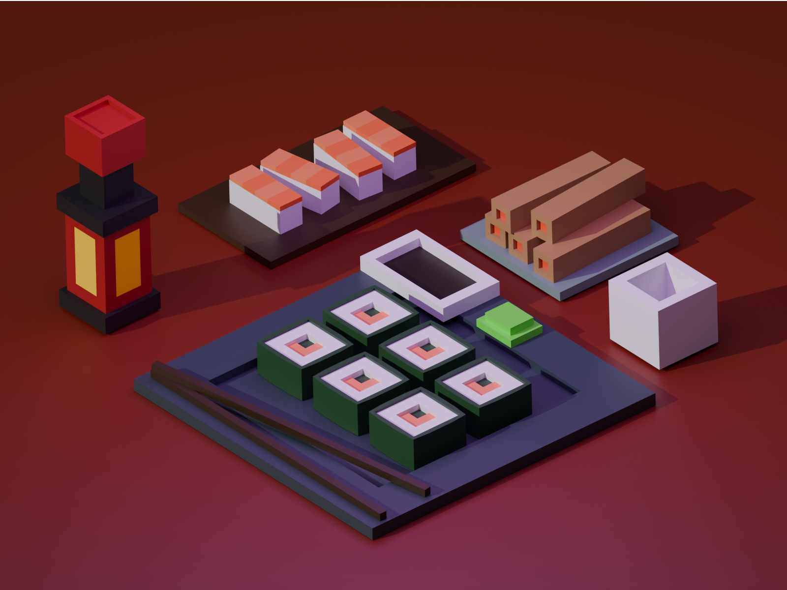
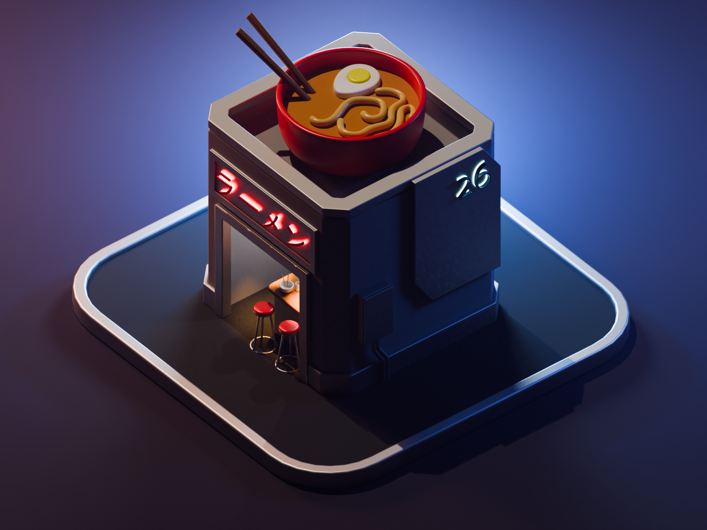

# Blender Learning Journey 🎨

This repository contains my beginner projects in Blender. I’m learning 3D modeling, animation, and rendering step by step.

## What’s inside
   
* Practice files
* Small experiments
* Progress over time

## Goal

To improve my Blender skills and document my learning journey.

## Tools

* Blender

## Pictures And Animations

### Pictures

* Sushi  

  
* Noodle Shop  

### Animations

Snippets from animations

* Noodle Shop Animation:
